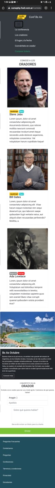
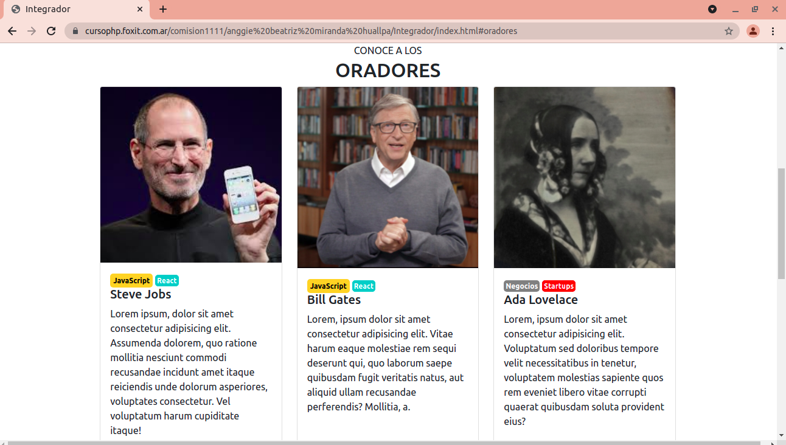
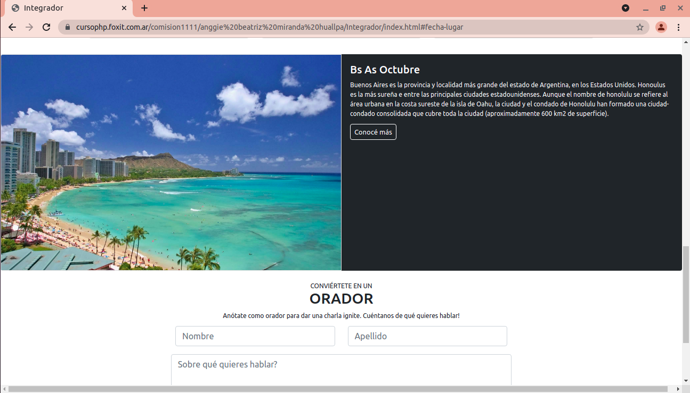
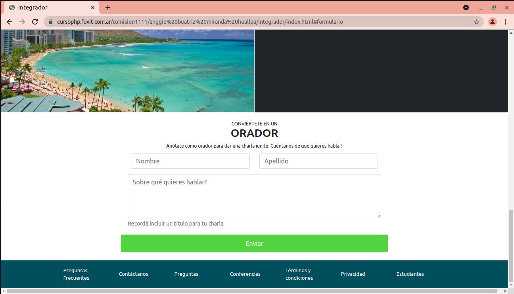

# Front-end
Desarrollador/a Full Stack Java - Programa Codo a Codo

<h2> Trabajo Práctico Integrador Nº1 </h2>

<h3><b>Consigna:</b></h3>

Se pide crear desde cero utilizando <b>HTML5, CSS3 y BOOTSTRAP</b> una página web responsive,
a partir del siguiente archivo entregado en formato .jpg.

<h4>Resolución: Fase 1 </h4>
Se realiza la maquetación y estructura de la página web con HTML y dándole el estilo pedido del formato .jpg con CSS y bootstrap.
Incluyendo botones, imagénes y un formulario.

Funcionalidades a seguir perfeccionando:
- Pulir aspectos del diseño web responsive.
- Mejorar organización de los archivos.
- Agregar funcionalidad para el botón "Comprar Tickets".

<h5 align="right">MOBILE</h5>

<h5>DESKTOP</h5>

