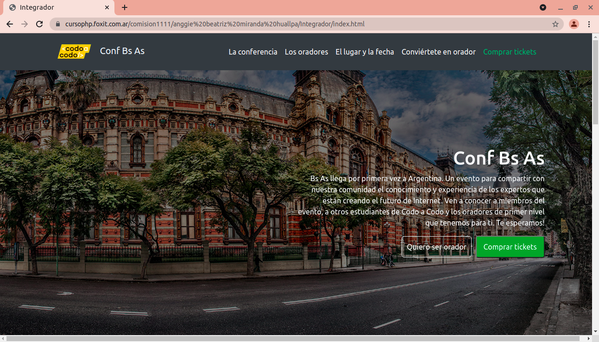

# Front-end
Desarrollador/a Full Stack Java - Programa Codo a Codo

<h2> Trabajo Práctico Integrador Nº1 </h2>

<h3><b>Consigna:</b></h3>

Se pide crear desde cero utilizando <b>HTML5, CSS3 y BOOTSTRAP</b> una página web responsive,
a partir del siguiente archivo entregado en formato .jpg.

<h4>Resolución: Fase 1 </h4>

Mediante sigamos avanzando en las unidades del Programa Codo a Codo, seguiré agregando funcionalidades como:
- Pulir aspectos del diseño web responsive.
- Animaciones con Javascript.
- Crear una base de datos, para que el usuario al ingresar sus datos se guarden correctamente.

<h5>DESKTOP</h5>

